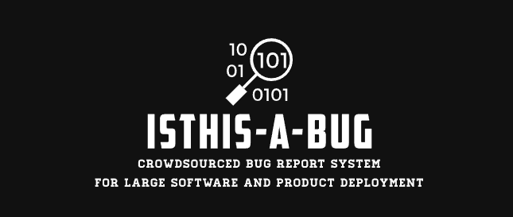
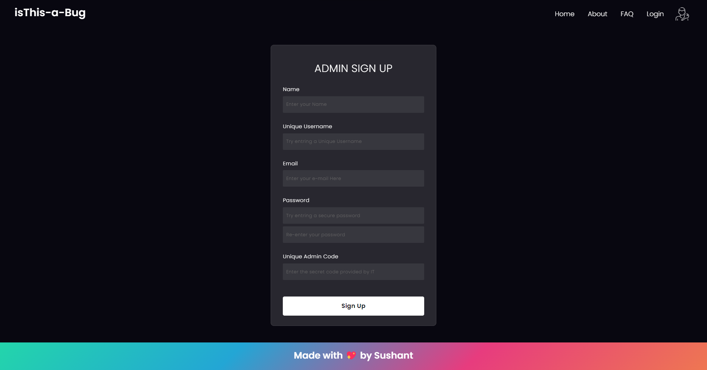
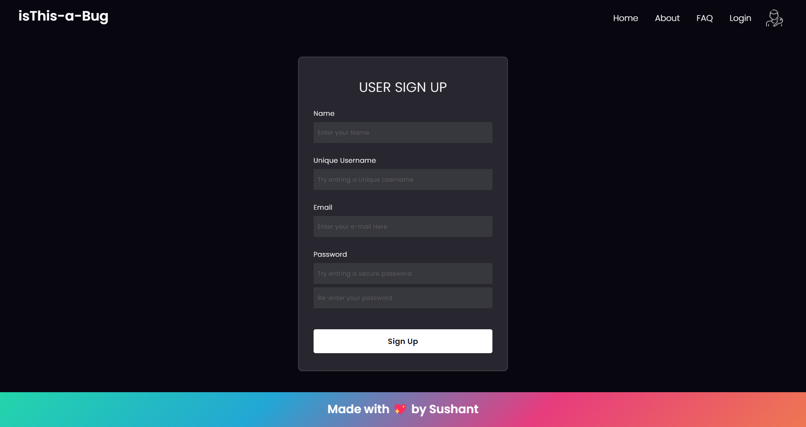
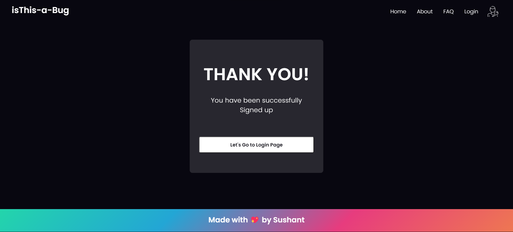
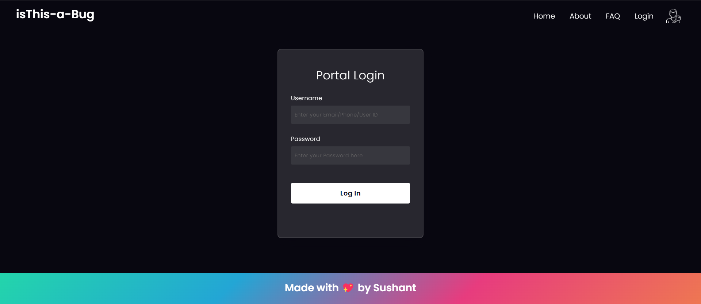
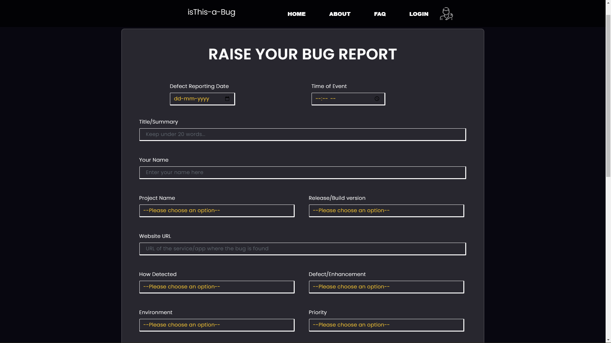
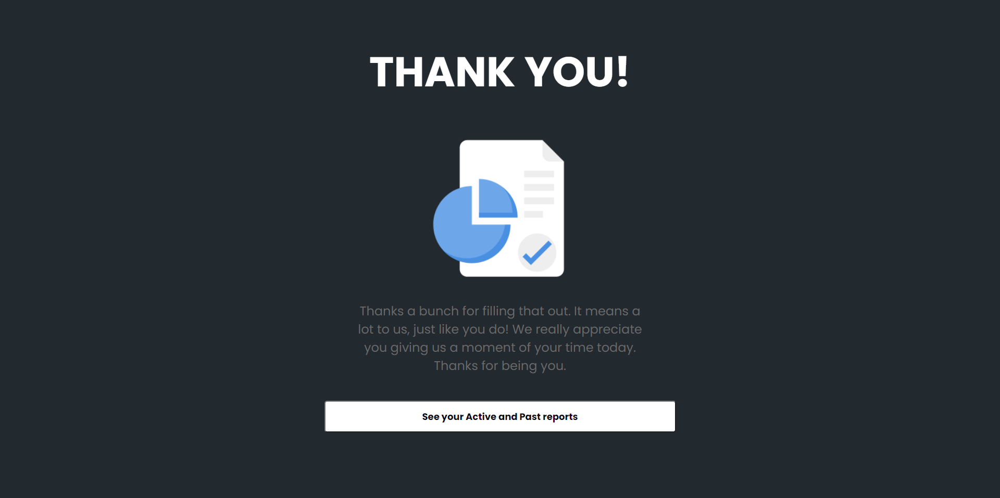
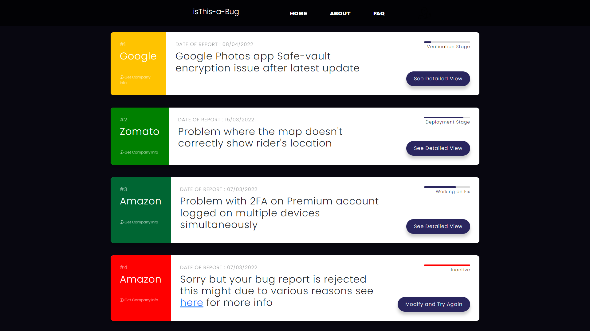

| <h2 style="margin-top:0" >Are you a user that come accross bugs and don't know where to report? or are you a developer going to release a large software & fear about bugs that went through the testing phase?</h2> | 
  
 |
| -------------------------------------------------------------------------------------------------------------------------------------------------------------------------------------------------------------------- | :-----------------------------------------------------------------------------------------------------------------------------------------------------------------: |

## This is your answer: A crowdsourced bug reporting system

### isThis-a-Bug is a web based application that provides facility for developer of big application and projects to get data about the bugs from their production build. Details such as the exact build of occurence, type of bug, decription, how to replicate and many more are easily accessible off the record.

### The system at any point can provide essential details of reported Bug, and their current status. With the data in hand Developers can work on them to improve their software and services for better User experience.

## App component Screenshots

### Admin Sign Up Page

### User Sign Up Page

### Successful Sign Up Page

### Portal Login Page

### Main Report Page

### Thank You Page After Reporting

### User Console

